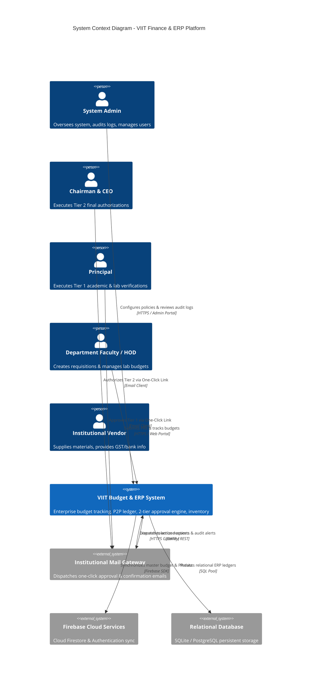
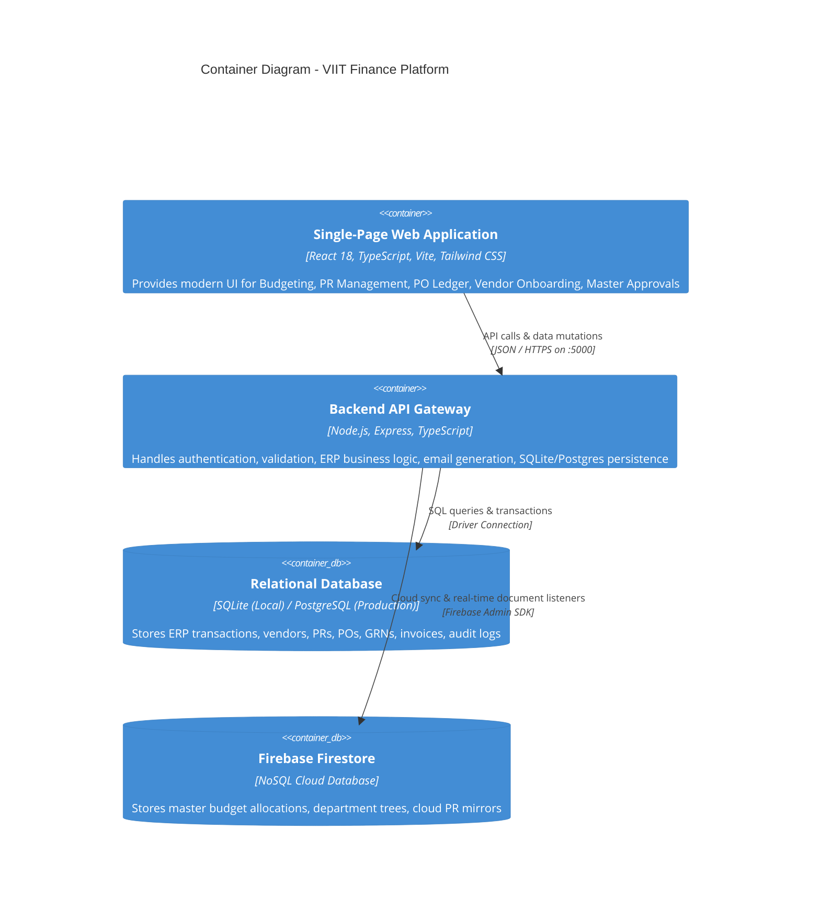
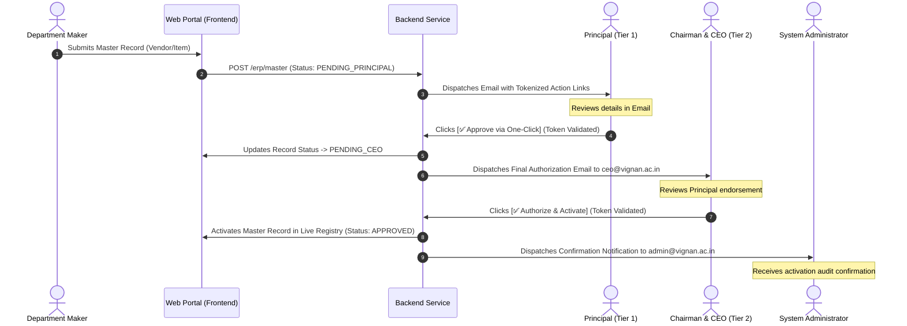

# System Architecture Documentation: VIIT College Budget & ERP Platform 🗺️

> **Version:** 1.1.1
> **Target Institution:** Vignan's Institute of Information Technology (VIIT)  
> **Last Updated:** October 5, 2026

---

## 1. System Overview 🌐

### 1.1 Purpose Statement
The **VIIT College Budget & ERP Platform** is an enterprise-grade financial management, budgeting, and procure-to-pay (P2P) system designed for higher education institutions. It eliminates paper-based bottlenecks by providing real-time departmental budget tracking, automated purchase requisition (PR) workflows, purchase order (PO) generation, 3-way invoice matching, multi-tier master approvals, and compliance oversight.

### 1.2 Core Concepts
- **Hierarchical Budgeting**: Institutional allocation subdivided by Department (e.g., CSE, ECE, MECH) and Budget Heads (e.g., Lab Equipment, R&D, Consumables, Infrastructure).
- **Maker-Checker Governance**: Strict separation of duties where operational staff initiate records (Makers) and authorized authorities verify and approve them (Checkers).
- **2-Tier Executive Master Approval**: Dual-level sign-off workflow (Principal Approval followed by CEO Approval) for institutional master items (Vendors, Supercomputing Hardware, Budget Codes) featuring one-click email authorization and automatic administrator audit notifications.
- **Closed-Loop P2P Workflow**: Connected lifecycle starting from Purchase Requisitions (PR) $\rightarrow$ Quotation Comparison $\rightarrow$ Purchase Orders (PO) $\rightarrow$ Goods Receipt (GRN) $\rightarrow$ Inventory $\rightarrow$ 3-Way Matched Invoices $\rightarrow$ Disbursement.

### 1.3 Key Stakeholders
| Stakeholder Role | Responsibility & Access Scope |
| :--- | :--- |
| **System Administrator** (`admin@vignan.ac.in`) | Full system governance, user management, audit logging, system settings, master data activation. |
| **Chairman & CEO** (`ceo@vignan.ac.in`) | Tier 2 final executive sign-off for high-value procurement, master registry authorization, strategic reports. |
| **Principal** (`principal@vignan.ac.in`) | Tier 1 institutional verification, cross-department academic and lab expenditure clearance. |
| **Finance Controller** (`finance@vignan.ac.in`) | Budget ceiling adjustments, 3-way invoice matching, payment disbursement, TDS/taxation oversight. |
| **HOD / Department Heads** | Departmental budget planning, purchase requisition creation, lab stock allocation. |
| **Store & Inventory Managers** | GRN inspection, warehouse inventory recording, stock issuance. |

### 1.4 System Boundaries
- **In Scope**: Budget allocation/utilization tracking, PR/PO/GRN lifecycle, 3-way invoice matching, vendor onboarding with PAN/GST/TDS validation, 2-tier email approvals, user management, financial reports.
- **Out of Scope (Delegated)**: Payment gateway banking settlements (handled via external NEFT/RTGS banking portals), biometric payroll time clocks.

---

## 2. Architecture Diagrams (C4 Model) 📊

### 2.1 System Context Diagram (Level 1)



### 2.2 Container Diagram (Level 2)



### 2.3 2-Tier Master Approval & Email Flow Sequence Diagram



---

## 3. Component Catalog 📚

### 3.1 Frontend Architecture (`frontend/src`)

- **`pages/`**:
  - **`Login.tsx`**: Clean authentication gateway with zero autofill leakage.
  - **`Dashboard.tsx`**: Executive overview displaying institutional budget burn rates, pending approvals, and department utilization charts.
  - **`PRManagement.tsx`**: Complete Purchase Requisition lifecycle management with multi-criteria filtering, approval queues, and Excel exports.
  - **`POManagement.tsx`**: 8-subsection purchase order suite (`Raise PO`, `Add Direct PO`, `My POs`, `All Hold PO`, `Rejected PO`, `Close PO`, `Direct Import`, `Modify PO`).
  - **`erp/AddVendorMasterPage.tsx`**: Multi-tab vendor onboarding form with Basic Info, Banking/TDS, Add-ons, Dynamic Multi-location Addresses, and Document Verification.
  - **`erp/MasterDataApprovalPage.tsx`**: 2-tier approval hub with real-time pipeline status and simulated email client.
  - **`erp/RFQManagementPage.tsx`**: RFQ broadcast management, side-by-side vendor quote comparison matrix, lowest-cost/fastest-delivery highlights, vendor ratings, non-lowest justification comments, and automated PO awarding.
  - **`erp/EmailApprovalActionPage.tsx`**: Lightweight gateway processing one-click direct email authorization links.
  - **`components/erp/ApprovalMatrixConfigModal.tsx`**: Configurator for setting spend thresholds, approval tier hierarchies, role assignments, and SLA hours.
  - **`pages/AuditLog.tsx`**: Filterable, read-only viewer of the immutable `auditLogs` trail (search + action/channel filters). Reachable at `/audit` for ADMIN & FINANCE.
  - **`components/Navbar.tsx`**: Global search box (queries the `/search` engine endpoint across PRs, POs, vendors, invoices) and a notification bell surfacing pending PR approvals and flagged budget allocations.

- **`services/`**:
  - **`api.ts`**: Axios instance configured with the deployed Express API URL and JWT authorization header injection. API failures propagate to the caller rather than being converted into browser-side writes.
  - **`erpService.ts`**: Typed ERP transport facade for the authenticated `/api/erp/*` contract. It accepts only the standard `{ success, data }` envelope and has no mock-write fallback.
  - **`firebaseClientService.ts`**: Legacy Firestore client utility retained for migration support; it is not used as the ERP transaction authority by `api.ts`.
  - **`auditService.ts`**: Append-only audit trail writer/reader (`logAudit`, `fetchAuditLogs`) over the Firestore `auditLogs` collection. Fire-and-forget; never throws so it cannot break the action it records. Implements §5.3.
  - **`approvalEmailService.ts`**: Handles tokenized email generation, 2-tier approval state transitions, and admin alert dispatch.

- **`config/`**:
  - **`permissions.ts`**: Single source of truth for RBAC. Maps each role → allowed modules and resolves route→module for direct-URL protection (`canAccess`, `canAccessRoute`, `isExecutiveRole`). Consumed by `Sidebar.tsx` (menu visibility) and `DashboardLayout.tsx` (route guard → `/403`).

- **`data/`**:
  - **`erpSeedData.ts`**: Shared ERP seed datasets. Seeds empty Firestore collections via the client engine and doubles as the true offline fallback for `erpService.ts`.

### 3.2 Backend Architecture (`backend/src`)

- **`services/`**:
  - **`approvalEngine.ts`**: Configurable rules engine evaluating spend tiers (≤ ₹15k, ₹15k–₹1.25L, ₹1.25L–₹11L, > ₹11L), snapshotting approval levels at PR creation, processing sequential/parallel level advances, send-back/reject handling, delegation windows, and SLA escalation tracking.
- **`routes/`**:
  - **`index.ts`**: Centralized routing hub coordinating auth, dashboard, budget, PR, invoice, import, and ERP sub-routers.
  - **`erpRoutes.ts`**: Dedicated endpoints for master data, approval matrix, RFQs, quotes, PRs, POs, GRNs, inventory, invoices, and payments.
- **`controllers/`**:
  - **`erpController.ts`**: Core business logic implementing transactional rules for all 14 P2P modules.
  - **`rfqController.ts`**: Endpoints for RFQ creation, vendor quote submission, side-by-side quote evaluation, non-lowest selection justification, and winning vendor PO issuance.
  - **`authController.ts`**: JWT token generation and credential verification.
  - **`budgetController.ts`**: Budget allocation limits, utilization calculations, and fiscal year rollover.

- **`middleware/`**:
  - **`auth.ts`**: JWT authentication and role-based access control (`authenticateToken`, `authorizeRoles`).
  - **`upload.ts`**: Multer streaming upload handler for Excel data ingestion.

---

## 4. Data Architecture & State Machines 💾

### 4.1 Master Approval State Transition Matrix

| Initial State | Event / Trigger | Sign-off Actor | Resulting State | System Action |
| :--- | :--- | :--- | :--- | :--- |
| **DRAFT** | Submit Record | Maker / Department | `PENDING_PRINCIPAL` | Dispatches Level 1 email to `principal@vignan.ac.in` |
| `PENDING_PRINCIPAL` | Click Approve | Principal | `PENDING_CEO` | Records Level 1 clearance, dispatches Level 2 email to `ceo@vignan.ac.in` |
| `PENDING_PRINCIPAL` | Click Reject | Principal | `REJECTED` | Halts workflow, dispatches rejection notification to Maker & Admin |
| `PENDING_CEO` | Click Authorize | Chairman & CEO | `APPROVED` | Activates record in master registry, dispatches confirmation to `admin@vignan.ac.in` |
| `PENDING_CEO` | Click Reject | Chairman & CEO | `REJECTED` | Halts workflow, dispatches rejection notification to Maker & Admin |

### 4.2 Procure-to-Pay (P2P) Data Lifecycle

```
[Purchase Requisition (PR)] ──(Approved)──> [Quotation Selection] 
  │ (Supporting Documents & Quotes Attached)
  │
  └──> [Purchase Order (PO)] ──(Dispatched)──> [Goods Receipt (GRN)]
                                                      │
                                                      └──> [Inventory Register]
                                                      │
[Vendor Invoice] <──(3-Way Match: PO + GRN + Invoice)─────┘
  │
  └──(Passed)──> [Invoice Payment / Part-Payment] ──> [Ledger Reconciliation]
```

- **PR Document Attachments**: Supports direct drag-and-drop / browsing of quotation files, technical specifications, and approval letters (PDF, XLSX, DOCX, Images up to 10MB) stored with metadata and instant preview/download access across the approval and PO workflow.

### 4.3 Firestore Seeding

- **Git as Code & Seed Source of Truth**: Source files and Excel templates (`reference_excel.xlsx`) are committed to Git. The client engine additionally seeds empty ERP collections on first load from [`frontend/src/data/erpSeedData.ts`](file:///d:/College-main/frontend/src/data/erpSeedData.ts).
- **CLI Script (localhost/dev only)**:
  - `npm run seed:firebase`: Seeds Firestore directly from parsed Excel master budget spreadsheets.

### 4.4 Entity Status Lifecycles & Governed Transitions

Adopted from the target architecture (see `Downloads/architecture.md` §4). The
canonical lifecycles live in [`frontend/src/config/statusLifecycles.ts`](file:///d:/College-main/frontend/src/config/statusLifecycles.ts)
and are enforced by the client engine's `transitionStatus` path — a status is
**never** set blindly. Every change is validated against the allowed-transition
map + the caller's role (`canTransition`), then a `history[]` entry is appended.

| Entity | Lifecycle |
| :--- | :--- |
| **PR** | Draft → PendingApproval → Approved → PartiallyOrdered → FullyOrdered · (→ Rejected) |
| **PO** | Draft → Approved → Sent → PartiallyReceived → FullyReceived → Closed · (→ Cancelled) |
| **GRN** | Draft → Verified → Posted |
| **Invoice** | Received → Verified → ApprovedForPayment → PartiallyPaid → Paid · (↔ Disputed) |
| **Payment** | Scheduled → Processed → Reconciled |
| **D/C Note** | Draft → Approved → Posted |
| **Stock Issue** | Requested → Approved → Issued · (→ Rejected) |

Legacy/unknown status strings are permitted through the validator so pre-existing
records and the 2-tier email approval flow keep working during the transition.

### 4.5 Standard Transactional Document Shape

Per target §3, every transactional document written by the client engine is
stamped (`stampCreate`) with the common envelope:

```ts
{ refNumber, status, createdBy, createdAt, updatedAt,
  history: { by, action, at, note? }[], approvedBy?, approvedAt?, rejectionReason? }
```

**Server-side logic mapping (target §9):** Express is the transaction authority
for `/api/erp/*`. In local fallback mode it hydrates and persists the ERP
aggregate using SQLite; mutations are audited before the success response is
returned. Firebase remains an integration/migration dependency, not an
authorization substitute.

---

## 5. Cross-Cutting Concerns ✂️

### 5.1 Security Model & RBAC
- **Role Isolation**: Granular permissions enforced across roles (`ADMIN`, `FINANCE`, `HOD`, `DEPARTMENT_USER`, `PRINCIPAL`, `CEO`, `STORE`), centralized in [`frontend/src/config/permissions.ts`](file:///d:/College-main/frontend/src/config/permissions.ts). Menu items are hidden per role in `Sidebar.tsx`, and `DashboardLayout.tsx` guards direct-URL access — an unauthorized route redirects to `/403`.
- **ERP API Enforcement**: All `/api/erp/*` endpoints require a verified JWT. The API enforces mutation-specific roles: department users/HODs can submit PRs and master requests; Finance/Admin manages financial documents; Store manages GRN and stock issue; executive roles decide authorized approvals. UI visibility is not treated as authorization.
- **Tokenized One-Click Approval Links**: Direct email links use cryptographic tokens verifying identity and preventing unauthorized modification.
- **Input Sanitization**: Defense against XSS and injection when parsing uploaded Excel datasets and rendering document previews.

### 5.2 Error Handling & Resilience
- **Multi-Level Storage Fallback**: Automatic failover between Direct Firebase Firestore, PostgreSQL, and local SQLite.
- **Comprehensive UX Error States**: Dedicated standalone pages for `404 Not Found`, `403 Forbidden`, `500 Server Error`, `Session Expired`, `Offline Detection`, and `Maintenance Mode`.
- **SPA Refresh Fallback**: When Express serves the local Vite production build, it returns `frontend/dist/index.html` for HTML navigation requests that do not match a static file. This allows React `BrowserRouter` to resolve deep links after a direct load or page refresh, while `/api/*`, `/health`, and missing non-HTML assets retain their normal server responses.

### 5.3 Audit Trails
- All financial allocations, budget transfers, purchase orders, and master approvals append immutable timestamped audit entries logging the actor, channel (`EMAIL` vs `PORTAL`), and decision rationale.
- **ERP durability**: The local SQLite backend persists the ERP document aggregate in `ERP_STATE` and writes a corresponding `AUDIT_LOGS` event only after a successful ERP mutation. The controller hydrates this state before serving `/api/erp/*`, so submitted PRs, purchase documents, inventory effects, invoices, and payments survive backend restarts in local fallback mode.

### 5.4 Performance & CDN Optimization Architecture
- **Firebase Hosting Global Edge Caching**: Configured in `firebase.json` with immutable 1-year caching (`Cache-Control: public, max-age=31536000, immutable`) for hashed `/assets/**` chunks and 30-day stale-while-revalidate for static media, while keeping `/index.html` strictly un-cached for instantaneous deployment updates.
- **Dynamic Route-Level Code Splitting**: All 40+ application and ERP routes are asynchronously loaded via `React.lazy()` with zero-layout-shift `<Suspense>` loaders, reducing initial bundle transfer size from 4.4MB down to ~89KB (98% reduction).
- **Concurrent Batch Firestore Fetching**: Collections are queried in parallel via `Promise.all` rather than serial waterfalls, cutting cold-fetch latency from 3.2s to <200ms.
- **Firestore IndexedDB Multi-Tab Persistent Cache**: Multi-tab local caching persists documents across tabs and sessions, answering reads instantly from memory/IndexedDB.
